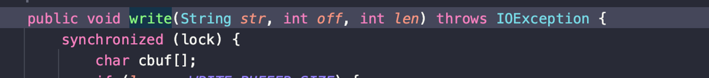
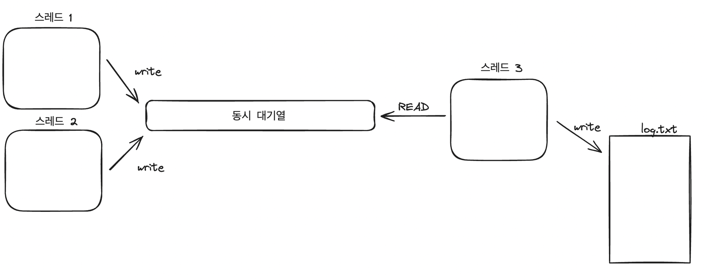

## 6.1.3 싱글패턴의 적용

```java
public class Logger {
    private FileWriter writer;

    public Logger() {
        final File file = new File("log.txt"); // 💥
        try {
            writer = new FileWriter(file, true);
        } catch (IOException e) {
            throw new RuntimeException(e);
        }
    }

    public void log(String message) {
        try {
            writer.write(message);
        } catch (IOException e) {
            throw new RuntimeException(e);
        }
    }
}
```

위와 같은 코드라면 각 스레드에서 서로 다른 Logger 인스턴스를 생성해서 사용한다고 하더라도 문제가💥  있다

- 동일한 파일에 대해 접근하고 있는 문제
    - 동시 접근시, 파일 포인터를 공유해, 로그가 덮어씌워지게 됨.

💡 이런 리소스 경합 문제는 어떻게 해결 해야 할까  ?

- ✅ 역시, 잠금
    - 그야말로, 한 곳 에서만 선점할 수 있는 Lock 으로는 mutex 가 있으며 ( 세마포어는 , 2개 이상이 점유하는 것도 가능 ) , 가장 간단하게 synchronized 를 사용해 아래와 같이 구현

        ```java
            public void log0(String message) {
                try {
                    writer.write(message);
                } catch (IOException e) {
                    throw new RuntimeException(e);
                }
            }
            
            public void log1(String message) {
                try {
                    synchronized (this) { // 💥
                        writer.write(message);    
                    }
                } catch (IOException e) {
                    throw new RuntimeException(e);
                }
            }
        ```

        - 하지만 , lock 을 거는 대상이 “Logger 인스턴스” 임. → “객체 수준의 잠금”
            - 서로 다른 스레드에서 서로 다른 Logger 인스턴스를 사용해 같은 파일에 접근하는 상황에선 역시 무용지물
        - 그리고 log1 처럼 안 해도 이미 FilreWriter 클래스 특성상 log0 와 같은 상황임 ( FileWriter 내부를 파고들어가면 , 위와 같이 객체단위의 잠금이 이미 걸려있음)

          

    - 분산잠금
        - 안정적,버그없는,고성능 분산잠금 구현은 어려움.
    - 동시 대기열(BlockingQueue..)
        - 여러 스레드가동시 대기열에는 동시에 기록, 별도의 스레드가 file 에 로깅
        - 아래 그림 excalidraw code

        

- ✅ 근본적인 문제 해결
    - 서로 다른 Logger ‘객체’를 사용하며 벌어지는 일
        - 싱글턴 패턴으로 구현된 Logger 객체 하나만을 사용하도록 하기

## 6.1.4 싱글턴 패턴 단점

아래 여러 단점들 때문에 **안티패턴이라고 인식되기도 한다**

- ✅ 클래스간 의존성을 감춘다
    - 보통, 매개변수 전달 같은 것을 통해 클래스간 의존성이 확실히 드러난다.
    - 하지만 싱글턴 클래스는, 마치 Util 클래스를 사용하듯이 함수 내부에서 사용해 버릴 수 있음
        - 이로 인해, **구현 내부를 주의깊게 살펴봐야, 싱글톤 클래스에 대한 의존성**이 보임.
- ✅ 코드 확장성에 영향
    - 이미 싱글턴 클래스로 설계된 것은,  대부분 전역 클래스로 사용되고 있을 것.
    - 나중에 2개 이상 인스턴스가 필요해지면 코드를 전면 수정하는 수 밖에 없음.
- ✅ 코드의 테스트 용이성에 영향
    - 특히 **싱글턴 클래스가 외부 리소스에 의존**하는 경우
        - 테스트에서 이를 Mocking 해 줄수도 없음.
    - 멤버 변수를 가진 경우
        - 해당 멤버변수는 실질적으로 전역변수 같은 효과.
            - 어떤 테스트에서 이 값을 변경하면, 테스트들의 독립성이 깨짐
- ✅ 매개변수가 있는 생성자를 지원하지 않음

    ```java
        private static UseInitSingleton instance = null;
        private final int paramA;
        private final int paramB;
    
        public UseInitSingleton(final int paramA, final int paramB) {
            this.paramA = paramA;
            this.paramB = paramB;
        }
    ```

    - 야매 방법 1 :  **코드 실행 의존성이 발생 (Init → getInstance 호출해야함)**

        ```java
        
            public static UseInitSingleton getInstance() {
                if(instance == null) {
                    throw new RuntimeException("Run init() first");
                }
                return instance;
            }
        
            public synchronized static UseInitSingleton init(int paramA, int paramB) {
                if(instance != null) {
                    throw new RuntimeException("Singleton has been created");
                }
                instance = new UseInitSingleton(paramA, paramB);
                return instance;
            }
        ```

    - 야매 방법 2 : 필드에 넣어줄 값을, 전역 변수로 선언해두고 이를 사용

        ```java
        public class Config {
        	public static final int PARAM_A = 12;
        	public static final int PARMA_B = 23;
        }
        
        public class Singleton {
        	private static final Signleton instance = null;
        	private final int paramA;
        	private final int paramB;
        	
        	private Singleton() {
        		this.paramA = Config.PARAM_A;
        		..
        	}
        ```

    - 야매 방법 3

        ```java
            public static UseInitSingleton getInstance2(int paramA, int paramB){
                if(instance == null){
                    instance = new UseInitSingleton(paramA, paramB);
                }
                return instance;
            }
        ```

      아래와 같은 방식은 문제가 존재함

        ```java
        UseInitSingleton singleton1 = getInstance2(10,20);
        UseInitSingleton singleton2 = getInstance2(30,40); // singleton2 도 10,20 으로 생성된 객체임( 이미 싱글턴 객체가 앞에서 생성)
        ```


## 6.1.5 싱글턴 패턴 대안

- 전역적으로 클래스 객체가 하나만 생성됨을 보장하는 다른 방법 ?
    - 팩토리 패턴
    - Spring 같은 DI 컨테이너를 사용
- 전역적 유일성 , 확장 가능, 테스트 용이성 보장
- 싱글턴 패턴이 안티패턴이며 사용하며 안된다는 주장은 다소 극단적. 디자인 패턴은 적절한 사용처에 사용하면 된다.
    - 이후 확장될 가능성이 없고, 외부시스템에 의존하지 않으면, 전역적으로 유일하도록 제한하기 위한 방법으로 싱글톤 클래스로 디자인해도 좋다.
        - 장점
            - new 를 통해 생성해서 클래스 사이에 전달할 필요 없다 ( 이게 의존성을 숨긴다고 하긴 했었지만 )

# 6.2 분산 싱글턴 패턴

## 6.2.1 싱글턴 패턴의 유일성

- **일반적인 싱글턴 패턴으로 설계된 클래스의 객체는 “하나의 프로세스(지금은 JVM) 내에서 전역적으로 유일함을 보장”**
    - 만약 싱글턴 패턴으로 구현된 객체를 가진 프로세스에서 fork() 를 사용해 child process 생성 한다면, 새로운 프로세스에도 복사된 싱글턴 클래스와, 해당 클래스의 객체가 존재한다.
    - **여러 프로세스에 걸쳐 유일하지는 않다**
    - **(+) Java 에서는, 더 엄격하게 말하면 “프로세스” 가 아닌 “클래스 로더” 내에서 유일**
- 프로세스 내에서 유일 vs 스레드 내에서 유일
    - 프로세스 내에서 유일 : 하나의 스레드 내에서 유일할 뿐만 아니라, 하나의 프로세스 내에 있는 모든 스레드에 걸쳐 유일
    - 스레드 내에서 유일 : 하나의 스레드 내에서만 유일. **여러 스레드에 걸쳐서는 유일하지 않을 수 있음.**
- 스레드 전용 싱글턴 패턴 코드

    ```java
    public class ThreadSingleton {
        private AtomicLong id = new AtomicLong(0);
        private static final ConcurrentHashMap<Long, IdGenerator> instances
                = new ConcurrentHashMap<>();
    
        private ThreadSingleton() {
        }
    
        public static IdGenerator getInstance() {
            final long currentThreadID = Thread.currentThread().getId();
            instances.putIfAbsent(currentThreadID, new IdGenerator());
            return instances.get(currentThreadID);
        }
    
        public long getId() {
            return id.incrementAndGet();
        }
    }
    ```


## 6.2.3 클러스터 환경에서 싱글턴 패턴

- 프로 세스 간에도 유일하도록 구현하기
    1. 분산락 획득
    2. 저장영역에서 가져와 객체로 역직렬화

## 6.2.4 다중 인스턴스 패턴

- 해당 타입의 객체 생성 개수가 제한되어 있는 것. == **동일한 유형의 객체는 하나만 생성**할 수 있으나, **다른 유형 객체는 여러 개를 생성할 수 있는 것**
    - 여기서 “유형” 이 실제 “타입” 은 아니다. 예를들어 아래 코드에서는 loggerName 이라는 문자열로 유형을 구분한다.

        ```java
        public class Logger {
        	private static final ConcurrentHashMap<String, Logger> instances = new ConcurrentHashMap<>();
        	
        	private Logger() {}
        	
        	public static Logger getInstance(String loggerName){
        			instances.putIfAbsent(loggerName, new Logger());
        			return instances.get(loggerName);
        				}
        					...
        	}
        ```

- 팩토리 패턴 과 유사 ?
    - 실제 다중인스턴스 패턴은 “동일한 타입” 객체
    - 팩터리 패턴은 “서로 다른 하위 타입” 객체 생성
- 열거형 이 다중인스턴스 패턴과 유사

# 6.3 팩터리 패턴

- 첫 번째 분류법
    - 단순 팩토리 패턴 simple factory pattern
    - 팩토리 메서드 패턴 factory method pattern
    - 추상 팩토리 패턴abstract factory pattern

### 6.3.1 단순 팩터리 패턴

```java
public class RuleConfigSource {
	public RuleConfig load(String ruleConfigFilePath) {
			String ruleConfigFileExtension = getFileExtension(ruleConfigFilePath); // json, xml, yaml 과 같은 config 파일의 확장자 가져옴
			IRuleConfigParser parser = null;
			if ("json.equalsIgnoreCase(ruleConfigFileExtension)) {
					parser = new JsonRuleConfigParser();
			} else if ("xml.equalsIgnoreCase(ruleConfigFileExtension)) {
					parser = new XmlRuleConfigParser();
			}...
	}
	String configText = "";
	// ruleConfigFileExtension 파일에서 configText 로 텍스트 읽기 
	RuleConfig ruleConfig = parser.parse(configText);
	return ruleConfig;
```

위 코드에서 Parser 객체 생성과 관련된 부분을 추출하여 별도 메서드로 캡슐화 하면

```java
private IRuleConfigParser createParser(String configrFormat) {
			IRuleConfigParser parser = null;
			if ("json.equalsIgnoreCase(ruleConfigFileExtension)) {
					parser = new JsonRuleConfigParser();
			} else if ("xml.equalsIgnoreCase(ruleConfigFileExtension)) {
					parser = new XmlRuleConfigParser();
			}...
			return parser;
}
```

SRP 를 위해 createParser 함수를 별도 클래스로 분리하고, Parser 객체 생성만 담당하도록 한다면

```java
public class RuleConfigParserFactory {
	public static IRuleConfigParser createParser(String configrFormat) {
			IRuleConfigParser parser = null;
			if ("json.equalsIgnoreCase(ruleConfigFileExtension)) {
					parser = new JsonRuleConfigParser();
			} else if ("xml.equalsIgnoreCase(ruleConfigFileExtension)) {
					parser = new XmlRuleConfigParser();
			}...
			return parser;
	}
}
```

- 단순 팩터리 패턴
    - 클래스 네이밍
        - XXXFactory 로 끝나는 네이밍이 흔함
    - 메서드 네이밍
        - createXXX , getInstance(), newInstance() , valueOf() 등등
- 위 코드 단점
    - parser 객체를 가져올 때 마다, 새로운 Parser 객체 생성
- 캐싱을 적용한 팩토리를 간단하게 구현

```java
public class RuleConfigParserFactry {
	private static final Map<Striung, RuleConfigParser> cachedParser = new HashMap<>();
	static {
		cachedParser.put("json", new JsonRuleConfigParser());
		cachedParser.put("xml", new XmlRuleConfigParser());
		..
	}
	public static IRuleConfigParser createParser(String configrFormat) {
		if(configFormat == null || configFormat.isEmpty()) {
			return null;
		}
		IRuleConfigParser parser = cachedParsers.get(configFormat.toLowerCase());
		return parser;
	}
}
```

- 위 코드의 단점
    - **새로운 유형의 IRuleConfigParser 타입 추가되면 Factory 클래스 코드 변경 → OCP 에 살짝 어긋남**
        - **BUT (장점) 생성된 parser 객체들을 사용하는 측에는 코드 변경이 일어나지 않음**
        - **팩터리 메서드 패턴은 단순팩터리 패턴보다 OCP 를 조금 더 지키게 됨**
