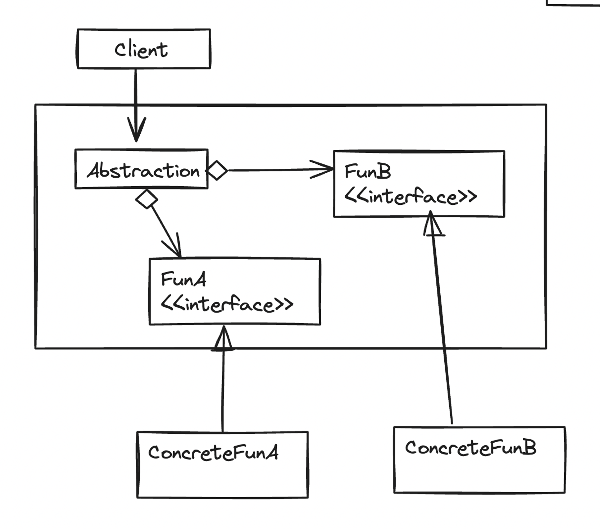
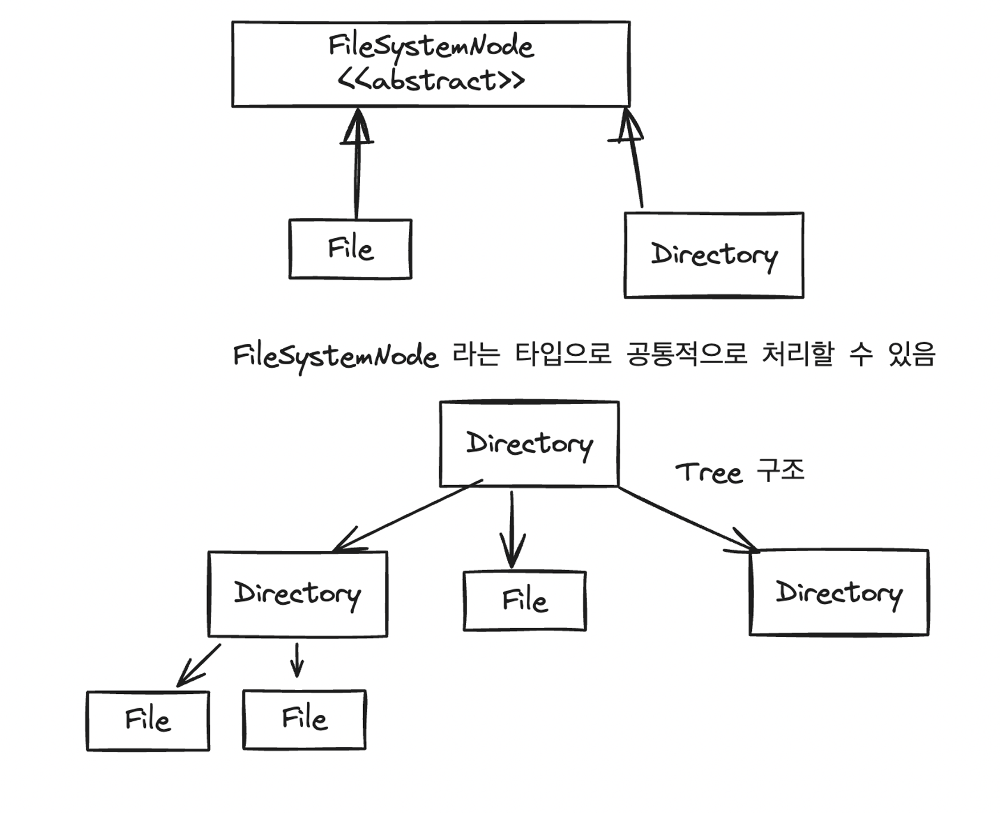

( 책 내용이 와닿지 않아 Guru 등을 참고하여 다르게 표현함)

- what ?
    - Decouple an abstraction from its implementation so that the two can vary independently( 🤔 특히 구현체를 독립적으로 변경할 수 있다는게 클 듯) .
    - [Guru](https://refactoring.guru/ko/design-patterns/bridge) : 큰 클래스 or 밀접하게 관련된 클래스들의 집합을, **두 계층(추상화, 구현) 으로 나누어 독립적으로 개발할 수 있도록 하는** 디자인 패턴. → 🤔 **각 계층들에서의 다양 화(variation) 가 가능하도록 계층화 하는 것**
- when ?
    - 하나의 복잡한 클래스가 계속해서 복잡해지는 (하나를 변경하려면 클래스 전체에 여러 변경이 가해지는 상황) 경우 .
    - SLF4J 로깅 프레임워크
        - 각 기능들을 Logger, Appender, Formatter 라는 핵심 개념으로 나누고, 각각에 대한 다양한 구현 형태를 가짐 → 각 기능들을 합성하여 다양한 로그 기록 방식 결정 가능
- For example
    - bridge pattern 에는 상속보다는 합성이 더 적합하다
        - 상속은 주로 복잡한 여러개의 하위 클래스들을 만들어 낸다
            - Fun 클래스의 A 기능에 대한 구현이 M 가지, B 기능에 대한 구현이 N 가지인 경우는, 하위 클래스가 M X N 개
        - 합성 관계로 설계 시 → a, b 구현체만 다르게 끼워넣음으로서 M X N 개의 조합을 할 수 있다

            ```java
            public class Fun {
            	private FunA a;
            	private FunB b;
            	...
            }
            ```

- 구조

  

- 🤔“상속 보다 합성”(설계사상) — Bridge pattern 의 차이 ? ❓
    - 차이점
        - 설계 사상 , 디자인 패턴 이라는 것 에서 다른게 아닐까 ? 디자인 패턴은 특정 문제를 해결하기 위한 것이고, 설계 사상은 설계 할 때 마다 “~~를 권장해” 이런 느낌 으로 받아들여짐.
        - 브릿지 패턴은 명시적으로 “합성” 을 하라는 건 아님. “추상화와 구현을 디커플링 하여 두 계층으로 분리” 하라는 거지.
    - 유사점
        - 둘 다 디커플링을 통한 유연한 설계를 유도 함

# Facade pattern

브릿지 패턴이랑 차이가 뭘까 ? **Facade 패턴은 Adapter 패턴처럼 “인터페이스 초점”**

- what ?
    - **서브 시스템에 대한 통합 인터페이스 세트를 제공**한다.
- why ?
    - **하위 시스템을 더 쉽게 만들기 위한 상위 통합 인터페이스**를 제공한다
- 구조
    - 어느정도의 크기를 인터페이스를 설계하는가는 어려운 문제
    - 인터페이스의 재사용, 사용 용이성을 중시해야 함.
        - 적절한 재사용성
        - 특수한 경우들에는 사용하기 쉬운 인터페이스를 제공하기 위해 퍼사트 인터페이스를 제공할 수 있다
            - 서브시스템 인터페이스의 a, b, c 기능을 순차적으로 호출 해야 하는 경우 →  Facade 인터페이스의 하나의 기능으로 제공해줄 수 있다
- 🤔 Adapter 패턴 과 Facade 패턴 모두 “사용하기 용이한 인터페이스 제공” 에 초점이 맞춰져 있다 . 둘 의 차이 ?
    - Adapter 패턴 : 우리가 건들 수 없는 코드를, 특정한 타입으로 제공하고 싶은 경우 인터페이스로 감싸준다고 생각함
    - Facade 패턴 : 복잡한 코드를 숨기고 사용하기 편한 코드를 제공하는 것에 초점을 맞춘다 생각함


# Composite pattern( 복합체 패턴 )

- what
    - you compose objects into tree structures and then work with these structures as if they were individual objects.
        - 객체들을 Tree 구조로 구성하고, 이 Tree 구조들 각각이 개별적인 객체인 것처럼 처리할 수 있도록 하는 디자인 패턴.
- when
    - 주로 Tree 구조로 되어 있는 데이터를 표현하는데 사용
- how
    - 부분-전체 계층 구조로 인식되는, 트리 구조로 구성된 객체 컬렉션
    - 개별 객체와 복합 객체의 재귀 탐색 논리를 통합
    - 주로 Tree 를 재귀적으로 순회 하면서, 공통적인 처리 방법(추상화된 처리 방법) 을 호출하며 처리 할 수 있도록 하는 구조. ( 알고리즘 문제 풀 때 Tree 에 대한 재귀 호출 하던 것 생각 )



# Flyweight pattern

- what ? when
    - 공유를 위해 사용되는 패턴 → 플라이웨이트 패턴 객체는 “불변 객체” 일 것
    - 객체를 재사용해 메모리 절약 위함
    - 메모리 절약을 위해, 동일 객체를 플라이웨이트로 생성
    - 동일한 객체가 아니더라도, 유사도가 높은 객체들 사이의 동일한 필드들만을 추출해 플라이웨이트로 설계
- HOW ?
    - 이를 테면 텍스트 편집기의 각 글자들 Character

        ```java
        public class Character {
        	private char c; 
        	private Font font;
        	private int size;
        	private int colorRGB;
        ```

      에서 font, size, colrRGB 는 CharacterStyle 이라는 flyweight 로 추출 하여 재사용 가능함.

    - XXXXFactory 등에 Collection 을 두고, 이 재사용 가능한 flyweight 객체들을 저장 해 두고 재사용 (마치 캐싱같은… )
    - 이 다음에 나오겠지만 Integer 도 내부적으로 Flyweight 패턴 사용됨 (일정 구간의 Integer 들을 미리 생성해두고 있음 -> literal 을 사용해 Integer 생성시,이 미리 생성해 둔 Integer 객체 사용)
- 주의
    - JVM 의 가비지 컬렉션 기능과 상성이 BAD
        - Factory 클래스 등에서 계속해서 flyweight 객체에 대한 참조를 유지하기에, 다른 코드에서 전혀 사용되고 있지 않은 상황에서도 JVM 에서의 가비지 컬렉션으로 메모리 회수가 일어나지 않음.
        - 객체의 수명이 짧고, 사용이 그다지 많지 않으면 오히려 더 많은 메모리를 사용할 수 있음.
        - 실제로 플라이웨이트 패턴이 메모리를 절약해 주는지 성능 측정하고 사용할 것 💥
