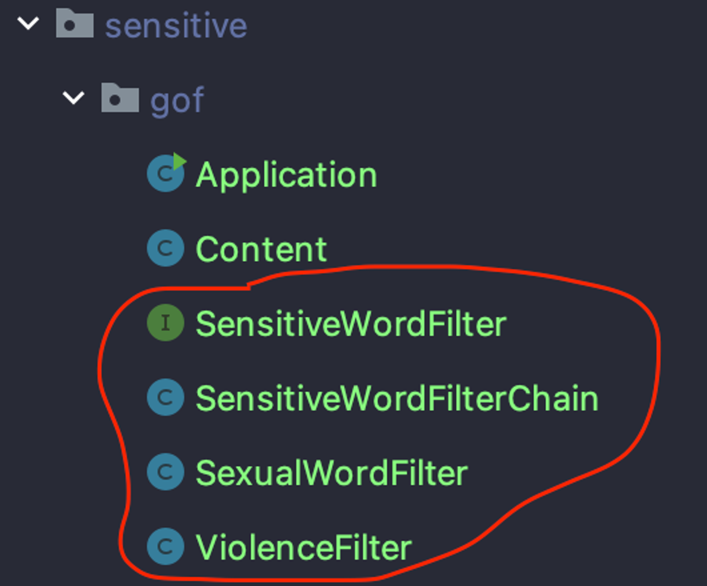

# 책임 연쇄 패턴

- 공통점을 가진 다음의 디자인 패턴들
    - 디자인 패턴
        - 템플릿 메서드 패턴
        - 전략 패턴
        - 책임 연쇄 패턴
    - 공통 적인 목적을 가짐
        - ‘**재사용성**’ 과 ‘**기능의 확장’**
    - 대다수의 프레임워크에서는 위 패턴들을 사용
        - 프레임워크 코드를 수정하지 않고도, 프레임워크의 기능을 사용자가 원하는 대로 변경할 수 있음.
        - 이번에 살펴볼 책임 연쇄 패턴이 사용되는 곳들
            - 필터, 인터셉터, 플러그인
- GOF 의 디자인 패턴
    - 정의
        - **여러개의 수신 객체가 발신된 요청을 처리할 수** 있도록, 요청의 발신과 수신을 분리한다.
        - **요청을 처리할 수 있는 수신 객체를 만날 때 까지 체인을 따라 계속 이동**한다.
- 특징
    - 여러 개의 수신객체(***프로세서***)가 동일 요청을 “차례대로 처리” 한다
        - 다음 프로세서로 요청을 전달하는 방식으로 **체인을 형성.**
        - 각 프로세서 에서는 각자의 책임을 가짐.
- 구현
    - **Handler, HandlerChain**
    - 방법1  ***LinkedList 자료 구조(***🤔순서가 있는자료구조***) 형태로 구현*** 된 HandlerChain → linkedlist 를 타고 연쇄적으로 호출하는 방식

        ```jsx
        public abstract class Handler {
            protected Handler successor = null;
            
            public void setSuccessor(Handler successor) {
                this.successor = successor;
            }
            
            public abstract void handle();
        }
        ```

        ```java
        public class HandlerChain {
        
            private Handler head = null;
            private Handler tail = null;
        
            public void addHandler(Handler handler) {
                handler.setSuccessor(null);
                if (head == null) {
                    head = handler;
                    tail = handler;
                    return;
                }
                tail.setSuccessor(handler);
                tail = handler;
            }
        
            public void handle() {
                if(head != null) {
                    head.handle();
                }
            }
        }
        ```

      Handler 추상 클래스가 위와 같을 경우, 발생하는 문제점

        - Handler 하위 클래스에는
            - 비즈니스 로직 + **‘다음 handler 를 호출하는 로직’** 이 섞임
                - **‘다음 handler 를 호출하는 로직’ 이  Handler 하위 클래스마다 반복**
                - **새로운 Handler 하위 클래스 추가 시, 해당 로직을 빠트리는 실수 가능성 O (끊겨버림)**
    - 방법 1 에 대한 해결책 → 템플릿 메서드 패턴
        - **반드시 수행되어야 하는 공통 코드**가 보이면 **템플릿 메서드 패턴을 사용하는 것을 고려**하자~
            - 추상 클래스의 final 함수로 정의해두고, 하위 클래스마다 달라져야 하는 비즈니스로직이 들어갈 메서드는 분리

        ```jsx
        public abstract class Handler {
            protected Handler successor = null;
        
            public void setSuccessor(Handler successor) {
                this.successor = successor;
            }
        
            public final void handle() {
                boolean handled = doHandle();
                if(!handled && successor != null) {
                    successor.handle();
                }
            }
            
            protected abstract boolean doHandle(); // 비즈니스코드
        }
        ```

    - 방법2 : ***배열 형태로 구현***된 HandlerChain → for 문으로 배열을 Iterate 하면서 순차적으로 호출하는 방식

        ```java
        public interface Handler {
            boolean handle(); // 비즈니스코드
        }
        ```

        ```java
        public class HandlerChain {
            private List<Handler> handlers = new ArrayList<>();
        
            public void addHandler(Handler handler) {
                this.handlers.add(handler);
            }
        
            public void handle() {
                for (Handler handler : handlers) {
                    final boolean handled = handler.handle();
                    if(handled) {
                        break;
                    }
                }
            }
        }
        ```

- 종류
    - GoF 의 디자인 패턴에 정의된 패턴
        - 체인 내의 **어떤 프로세서가 요청을 처리 할 수 있으면, 더 이상 다음으로 전달 X (멈춘다)**
    - 변형된 패턴
        - 체인을 타고 요청이 전달 되는 **도중에 끝나지 않음.**
        - **요청은 모든 프로세스에서 처리된다. (끝까지 간다)**
        - 코드

            ```java
            public abstract class Handler {
            		// ...
                public final void handle() {
                    doHandle();
                    if(successor != null) { // doHandle() 의 결과와 상관없이 다음 프로세서를 호출
                        successor.handle();
                    }
                }
                protected abstract boolean doHandle(); // 비즈니스코드
            }
            
            ```


## 예시 ) 민감 단어 필터링 구현

- 요구사항 : 민감한 단어가 포함된 컨텐츠를 처리 할 것
    - 방식 2 가지 : **GoF 의 디자인 패턴 정의 방식 / 변형된 책임 연쇄 패턴 방식**
        - 게시 자체 금지 (게시물 자체의 생성 금지)
            - 즉, **민감 단어 가 포함된** 컨텐츠의 생성 자체를 **도중에 막는 것**  → GoF 의 책임 연쇄 패턴 정의
        - 민감한 단어만 *** 로 대체하는 것
            - **민감 단어가 포함되었더라도**, 컨텐츠 생성까지는 **끝까지 통과하는 것** → 변형된 책임 연쇄 패턴
- 방식 1
    - 책임 연쇄 패턴으로 구현

        ```java
        public class SensitiveWordFilterChain {
            private List<SensitiveWordFilter> filters = new ArrayList<>();
        
            public void addFilter(SexualWordFilter filter) {
                this.filters.add(filter);
            }
        
            public boolean filter(Content content) {
                for (SensitiveWordFilter filter : filters) {
                    if (!filter.doFilter(content)) {
                        return false;
                    }
                }
        
                return true;
            }
        }
        ```

      이를 구현하기 위해 아래의 많은 클래스들 필요

      

    - if-else 문을 사용한 구현

        ```java
        public class SimpleSensitiveWordFilter {
        
            public boolean filter(Content content) {
                if (!filterViolenceWord(content)) {
                    return false;
                }
                if (!filterSexualWord(content)) {
                    return false;
                }
        
                return true;
            }
        
            private boolean filterViolenceWord(final Content content) {
                return false;
            }
        
            private boolean filterSexualWord(final Content content) {
                return false;
            }
        }
        ```

    - if-else 문 이 더 심플해 보임. 언제 책임 연쇄 패턴을 사용해야 하는 걸까?
        - 디자인 패턴 →
            - 코드 복잡도를 낮춤
            - OCP 를 가능케 함 → 코드 확장성 향상
        - 따라서, **코드가 커지고 복잡해지기 시작하면 코드를 분할하기 시작해야** 한다
            - 원래 시작은 함수를 작게 쪼개고 —> 클래스를 나누면서 디자인패턴을 적용할 수 있겠져
        - Application 클래스를 제외한 나머지는 프레임워크 코드라고 생각한다면?
            - 민감성 단어의 범주가 추가된다면 ? 예를들어 주식 컨텐츠는 제외 시킨다는 조건이 추가된다면 ?
                - 책임 연쇄 패턴
                    - 1) Filter 클래스를 추가로 정의
                    - 2) 사용자의 코드(Application) 에서 Chain 에 추가해 주기만 하면 됨
                    - 즉, **프레임워크 코드를 수정하지 않고 새로운 기능 추가 가능**


## 서블릿 필터, Spring 인터셉터, MyBatis 플러그인

- 공통점
    - 원래의 코드를 수정하지 않아도 됨
    - 일부 메서드 호출을 가로채, 해당 메서드 호출 전 후에 몇 가지 코드를 실행

|  | 서블릿 필터 | Spring Interceptor | MyBatis 플러그인 |
| --- | --- | --- | --- |
| Handler | Filter | HandlerInterceptor | Interceptor |
| HandlerChain | FilterChain | HandlerExecutionChain | InterceptorChain |
| 가로채는대상 | 서블릿 요청 / 응답 | Bean 의 메서드 | MyBatis 프레임워크에 의한 SQL 문 실행과 관련된 일부 메서드 |
- 서블릿 필터
    - 서블릿 사양을 준수하는 웹 컨테이너에서 Filter, FilterChain 인터페이스에 대한 구현체를 제공
    - 이 Filter, FilterChain 은 어떻게 책임연쇄 원칙을 구현하고 있나?
        - 여기서는 재귀 방식으로 구현
            - code

                ```java
                public final class ApplicationFilterChain implements FilterChain {
                	
                		// 현재 실행 중인 필터 
                    private int pos = 0;
                
                    //필터 수
                    private int n = 0;
                
                    private Servlet servlet = null;
                    
                		private ApplicationFilterConfig[] filters = new ApplicationFilterConfig[0];
                		
                    @Override
                    public void doFilter(ServletRequest request, ServletResponse response) throws IOException, ServletException {
                
                        // Call the next filter if there is one
                        if (pos < n) {
                            ApplicationFilterConfig filterConfig = filters[pos++];
                            Filter filter = filterConfig.getFilter();
                           filter.doFilter(request, response, this); // Filterchain 을 전달
                
                				} else {
                					servlet.service(request, response); // filter 처리 후 servlet 실행
                				}
                		}
                		.....
                ```

              

            - 재귀함수로, FilterChain 의 필터들을 연쇄적으로 호출하기 위해 FilterChain 자체를 인자로 전달하고 있음

                ```java
                public ..implements Filter {
                
                	@Override
                	protected void doFilter(HttpServletRequest request, HttpServletResponse response, FilterChain filterChain)
                			throws ServletException, IOException {
                				...
                				filterChain.doFilter(requestToUse, response);
                				..
                
                ```

            - 양방향으로 가로채기가 가능함. 즉 , ServletRequest, ServletResponse 모두 가로 챌 수 있음
    - 추가할 Filter 클래스를 정의하고, 설정파일만 수정하면 적용됨.
- Spring interceptor
    - Spring MVC 프레임워크에서 제공하는 부분.
    - 재귀적이지 않음 → 좀 더 명확함
        - Filter 와 달리, Spring container 로 들어오는 요청, 컨트롤러에서 처리한 이후의 응답 각각에 대한 가로채기를 다른 함수에서 수행함.
            - preHandle , postHandle 이 두개의 메서드로, 가로챌 메서드의 앞뒤에 실행할 코드를 구현함
    - code

        ```java
        public class HandlerExecutionChain {
        		/**
        	 * Apply preHandle methods of registered interceptors.
        	 * @return {@code true} if the execution chain should proceed with the
        	 * next interceptor or the handler itself. Else, DispatcherServlet assumes
        	 * that this interceptor has already dealt with the response itself.
        	 */
        	boolean applyPreHandle(HttpServletRequest request, HttpServletResponse response) throws Exception {
        		for (int i = 0; i < this.interceptorList.size(); i++) {
        			HandlerInterceptor interceptor = this.interceptorList.get(i);
        			if (!interceptor.preHandle(request, response, this.handler)) {
        				triggerAfterCompletion(request, response, null);
        				return false;
        			}
        			this.interceptorIndex = i;
        		}
        		return true;
        	}
        
        	/**
        	 * Apply postHandle methods of registered interceptors.
        	 */
        	void applyPostHandle(HttpServletRequest request, HttpServletResponse response, @Nullable ModelAndView mv)
        			throws Exception {
        
        		for (int i = this.interceptorList.size() - 1; i >= 0; i--) {
        			HandlerInterceptor interceptor = this.interceptorList.get(i);
        			interceptor.postHandle(request, response, this.handler, mv);
        		}
        	}
        	....
        ```


- Mybatis 플러그인
    - 중첩 동적 프로시를 통해, 가로챌 메서드 앞뒤에 코드를 추가
    - 코드

        ```java
        @Intercepts({
        	@Signature(type = StatementHandler.class, method = "query", 
        		args = {Statement.class, ResultHandler.class}),
        	@Signature(type = StatementHandler.class, method = "update", 
        		args = {Statement.class, ResultHandler.class}),	
        	@Signature(type = StatementHandler.class, method = "batch", 
        		args = {Statement.class, ResultHandler.class})})
        public class SqlCostTimeInterceptor implements Interceptor {
        	private static Logger logger = LoggerFactory.getLogger(SqlCostTimeInterceptor.class);
        	
        	@Override
        	public Object intercept(Invocation invocation) throws Throwable {
        		Object target = invocation.getTarget();
        		long startTime = System.currentTimeMillis();
        		StatementHandler statementHandler = (StatementHandler) target;
        		
        		try {
        			return invocation.proceed();
        		} finally {
        			long costTime = System.currentTimeMillis() - startTime;
        			BoundSql boundSql = statementHandler.getBoundSql();
        			String sql = boundSql.getSql();
        			logger.info("SQL : [{}] Time [{} ms]", sql, costTime);
        			}
        		}
        	@Override
        	public Object plugin(Object target) {
        		return Plugin.wrap(target, this);
        	}
        	
        	@Override
        	public void setProperties(Properties properties) {
        		System.out.println("Setup Properties:" + properties);
        		}
        	}
        ```

    - @Intercepts 어노테이션  : 가로채려는 대상(메서드)을 명확하게 표시하는 역할
        - 여러 메서드를 가로채고 싶으면, @Signature 어노테이션 중첩이 가능하니 위와 같이 하면 됨.
        - type : 가로챌 클래스
        - method : 가로챌 메서드 이름
        - args : 해당 메서드의 매개변수
    - 동작
        - 최 하위에서 Executor 클래스를 통해 SQL 문을 실행.
            - Executro 는 StatementHandler,. ParameterHandler, ResultSetHandler 객체를 생성
            - 이후, ParameterHandler 클래스로 SQL 의 placeholder 매개변수를 설정한 다음, StatementHandler 클래스로 SQL 문을 실행.
            - 마지막으로 ResultSetHandler 클래스로, 실행 결과를 캡슐화.
        - 따라서 Executor, ParameterHandler, ResultSetHandler, StatementHandler 클래스의 메서드들을 가로채면, SQL 전체 실행 프로세스의 각 단계를 가로챌 수 있다.

# 상태패턴

- 복합체 패턴과 비슷
- 상태 머신 구현에 많이 사용
    - 상태 머신 구현 방법
        - 상태 패턴
        - 분기 판단 방식
        - 테이블 조회 방식
- FSM(Finite State Machine) 유한 상태 머신
    - 상태 머신 구성요소
        - 상태
            - ex) 엘리스의 키가 20cm 가 되었음
        - 이벤트
            - 전환 조건.
            - 상태 전이, 동작 실행을 촉발
                - 동작은 필수가 아님. 이벤트로 인해 상태 전이만 할 수도.
            - ex) 엘리스가 케이크를 먹음
        - 동작
            - ex) 엘리스가 문을 열 수 있는 동작을 할 수 있게 됨
- 분기 판단 방식
    - 코드가 너무 복잡함
    - 일부 상태 전이를 놓치거나, 잘못 사용할 수 있음.

    ```java
    public enum State {
        SMALL(0),
        SUPER(1),
        FIRE(2),
        CAPE(3),
        ;
    
        private int value;
    
        State(final int value) {
            this.value = value;
        }
    
        public int getValue() {
            return value;
        }
    }
    //===
    public class SwitchMarioStateMachine {
        private int score;
        private State currentState;
    
        public SwitchMarioStateMachine() {
            this.score = 0;
            this.currentState = State.SMALL;
        }
    
        public void obtainMushRoom() {
            if (State.SMALL.equals(currentState)) {
                this.currentState = State.SUPER;
                this.score += 100;
            }
        }
    
        public void obtainCape() {
            if (State.SMALL.equals(this.currentState) || State.SUPER.equals(this.currentState)) {
                this.currentState = State.CAPE;
                this.score += 200;
            }
        }
    
        public void obtainFireFlower() {
            if (State.SMALL.equals(this.currentState) || State.SUPER.equals(this.currentState)) {
                this.currentState = State.FIRE;
                this.score += 300;
            }
        }
    
        public void meetMonster() {
            if (State.SUPER.equals(this.currentState)) {
                this.currentState = State.SMALL;
                this.score -= 100;
                return;
            }
            if (State.CAPE.equals(this.currentState)) {
                this.currentState = State.SMALL;
                this.score -= 200;
                return;
            }
            if (State.FIRE.equals(this.currentState)) {
                this.currentState = State.SMALL;
                this.score -= 300;
                return;
            }
        }
    
        public int getScore() {
            return score;
        }
    
        public State getCurrentState() {
            return currentState;
        }
    }
    ```
