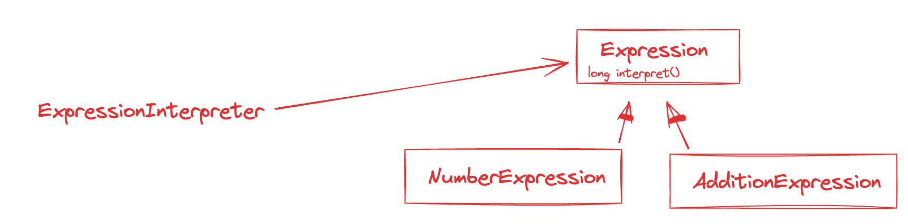
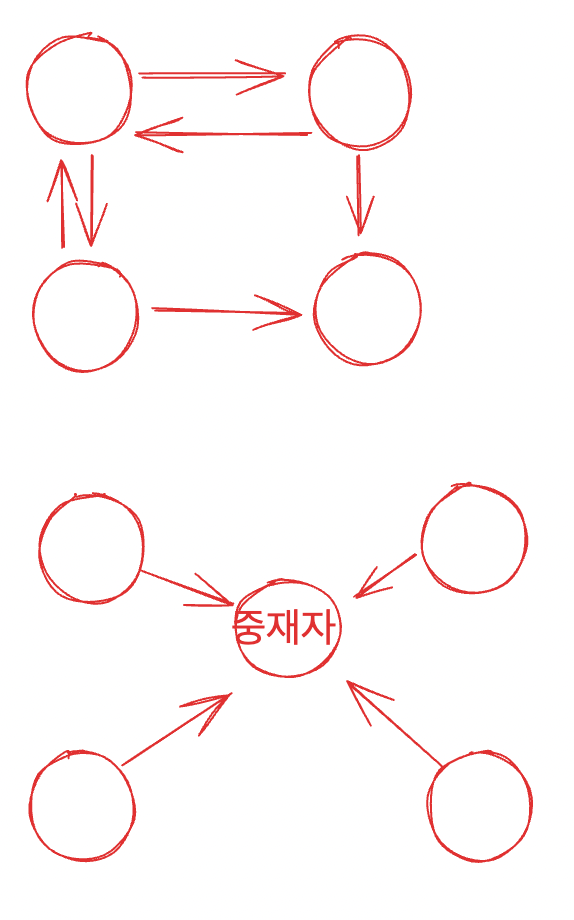

# 메멘토 패턴

- 적용 하는 곳
    - 데이터의 손실 방지, 취소, 복구 (**데이터 백업 및 복구**)
- ***캡슐화 원칙을 위반하지 않는다는 전제하***에서, (복사본 대상) 객체의 내부 상태를 획득하고 , 이 상태를 객체의 외부에 저장하여, 객체를 이전 상태로 복구할 수 있도록 한다
    - 나중에 복구할 수 있도록 복사본을 저장
    - 캡슐화 원칙을 위반하지 않을 것
    - 객체를 복원

예시 - 다음과 같은 커맨드라인 프로그램을 생각해보자

- 사용자가 텍스트 입력시, 메모리 내에 저장
- 사용자가 :list 입력시, 메모리 내에 저장된 텍스트를 출력
- 사용자가 :undo 입력 시, 마지막에 입력했던 텍스트 입력을 취소, 메모리 내의 텍스트에서도 삭제

## 캡슐화 원칙을 지키지 못한 코드

- 구현 코드

    ```java
    public class InputText {
    	private StringBuilder text = new StringBuilder();
    	
    	public String getText() {
    		return text.toString();
    	}
    	
    	public void append(String input) {
    		text.append(input);
    	}
    	
    	public void setText(String text) {
    		this.text.replace(0, this.text.length(), text);
    	}
    }
    
    public class SnapshotHolder {
    	private Stack<InputText> snapshots = new Stack<>();
    	
    	public InputText popSnapshot() {
    		return snapshots.pop();
    	}
    	
    	public void pushSnapshot(InputText inputText) {
    		InputText deepClonedInputText = new InputText();
    		deepClonedInputText.setText(inputText.getText();
    		snapshots.push(deepClonedInputText);
    	}
    }
    
    public class ApplicationMain {
    	public static void main(String[] args) {
    		InputText inputText = new InputText();
    		SnapshotHolder holder = new SnapshotHolder();
    		Scanner scanner = new Scanner(System.in);
    		while (scanner.hasNext()) {
    			String input = scanner.next();
    			if (input.equals(":list")) {
    				System.out.println(inputText.getText());
    			} else if (input.equals(":undo")) {
    				InputText snapshot = snapshotHolder.popSnapshot();
    				inputText.setText(snapshot.getText());
    			} else {
    				snapshotHolder.pushSnapshot(inputText);
    				inputText.append(input);
    			}
    		}
    }
    ```

- 이 구현이 메멘토 패턴을 충족시키지 못하는 이유
    - 객체 백업, 복원 과정에서 캡슐화 원칙을 위반하고 있다
    - 캡슐화 원칙을 위반하는 부분
        - public 한 setText 함수의 존재
            - set 이라는 이름.. → 외부에서 무작위로 , 이 inputText 객체의 내용을 변경시키는 모든 상황에 대해 getText 를 호출해 객체가 파괴될 수 있다(아마 예상하지 못한 결과가 나오는 객체가 된다는 뜻일 듯)
        - ***snaphot 은 변하면 안된다. snapshot 으로 사용되는 객체의 내부 상태를 변경하는 함수를 포함하고 있으면 안된다***. InputText 클래스는 append, setText 등 내부 상태 변경 함수 여러개를 포함하고 있다
- 캡슐화 원칙을 지키려면?
    - snapshot 을 위한 별도의 클래스를 정의하자.
        - 물론 이 **클래스는 불변**이도록.
    - setText 대신 , **함수의 목적을 정확하게 명시하는 다른 이름 (restoreSnapshot) 으로** 변경

## 시간과 공간 최적화

- 메멘토 패턴에서는 “백업할 객체” 가 중요함.
    - 앞에서 본 것 처럼, 백업할 객체로 사용되는 객체는 내부 상태를 변경하는 함수를 포함하고 있으면 안됨.
    - 뿐만 아니라, **백업할 객체가 큼 or 백업 빈도 높을 경우** 차지하는 메모리가 커지고, 백업 및 복구 시간이 길어짐.
- 이럴 경우, **증분백업(incremental backup) 과 전체 백업(full backup)** 방식을 나누고, 전체 백업 빈도 보다 증분 백업을 자주하는 것으로 처리할 수 있다.
    - 특정시점으로 복원해야 하는 경우 : 가장 가까운 시점의 전체 백업분으로 복원 → 복원 시점까지의 증분백업으로 복원해나감

# 커맨드 패턴

커맨드, 인터프리터,중재자 패턴은 자주 사용 되지 않으며 어려운 개념이라고 함.

- **요청을 객체로 캡슐화**하여, 다른 객체를 다른 요청, 대기역 요청, 로깅 요청과 함께 매개변수로 전달할 수 있도록 하며, 취소 가능한 작업을 지원한다.
- 핵심 : 함수를 객체로 캡슐화 하는 것.
    - 그리고는 ‘함수를 매개변수로 전달하기’ 등을 하는 것.
- 함수를 객체로 캡슐화 함으로서 가능해지는 것
    - 함수의 명령과 실행의 분리
    - 비동기, 지연 실행 명령 과 대기,실행취소, retry, 저장 명령 등 명령에 대한 더 복잡한 작업 수행이 가능.

예시 - 모바일 게임

모바일 게임 클라이언트는 복잡하다. 성능을 위해 게임 정보를 메모리에 올려두고 게임하는 동안에는 메모리에 있는 데이터만 업데이트 하다가, 게임이 끝나는 시점에 메모리상의 데이터를 db 로 전송한다.

가정

- 동일한 스테이지에 존재하는 플에이어들은 동일 서버에 할당,
- 동일 스테이지에서 다른 플레이어에 대한 정보를 가져올 때 다른 서버에서 정보를 조회할 필요는 없다.
- 클라이언트와 서버는 연결을 맺어 요청 및 응답으로 커뮤니케이션 한다. 클라이언트의 요청에는 ‘명령’과 ‘데이터’ 로 구성된다 ( HTTP 프로토콜의 메시지를 생각해보면 될 듯 )

## 싱글 서레드 서버를 커맨드 패턴으로 구현하기

- 클라이언트의 요청을 받기 위해 polling
- 요청을 받을 경우, 커맨드 패턴을 사용해 요청 내의 내용을 ‘명령 객체로 캡슐화’ 하여 메모리 queue 에 저장 (캐싱)
- 서버는 queue 에서 정해진 수의 명령을 가져와 실행 (싱글 스레드니)
- 실행 완료시 다시 polling

> **💡 즉, 클라이언트의 명령 (수신) 과, 이 명령을 처리하는 작업을 분리 하는 것**
>

클라이언트의 명령(요청)들을 즉시 실행하지않고 queue 에 캐싱하는 이유

- 싱글 스레드 서버인 경우, 하나의 스레드가 처리해야 하는 작업수가 굉장히 많음.
- 따라서 처리 속도의 균형을 유지하고, 수신한 명령을 순서대로 처리할 수 있도록 하기 위함.
- 최소한의 요청 수가 들어올 때 까지 처리를 대기하는 식으로 작업을 처리. 비동기로 명령 수신 및 저장을 하고 있는다

```java
public interface Command {
	void execute();
}

public class GotDiamondCommand implements Command {
	public GotDiamondCommand(..데이터) {}
	
	@Override
	public void execute(){..}
	
}
// GotStartCommand, HitObstacleCommand, ArchiveCommand 클래스 생략
public class GameApplication {
	private static final int MAX_HANDLED_REQ_COUNT_PER_LOOP = 100; 
	private Queue<Command> q = new LinkedList<>();
	
	public void mainloop() {
		while(true) {
		List<Request> requests = new ArrayList<>();
		
		// epoll, select 에서 데이터 가져와 Request 클래스로 캡슐화하는 코드 생략
		// 처리 시간 초과 시, 다음 코드를 실행
		for(Request request : requests) {
			Event event = request.getEvent();
			Command command = null;
			
			// ================아래 코드 때문에 전략 패턴을 사용하는 시나리오와 유사하다는 생각을 할 수도 있는듯 =====
			if (event.equals(Event.GOT_DIAMOND) {
				command = new GotDiamondCommand(..);
			} else if (event.equals(Event.GOT_START) {
			if (event.equals(Event.GOT_DIAMOND) {
				command = new GotStartCommand(..);
			} else if (event.equals(Event.HIT_OBSTACLE) {
				command = new HitObstacleCommand(..);
			} else if (event.equals(Event.ARCHIVE) {
				command = new ArchiveCommand(..);
			}
			// ==========================
			q.add(command);
		}
		int handledCount = 0;
		while (handledCount < MAX_HANDLED_REQ_COUNT_PER_LOOP ) {
			if(q.isEmpty() {
				break;
			}
			Command command = q.poll();
			commaand.execut4e();
			handledCount++;
		}
	}
}
		
			
```

## 전략패턴과 커맨드 패턴

디자인 패턴들을 설계사상이나 코드구현 방식 관점에서 보면, 대부분이 비슷해보임 → 각 디자인패턴의 응용 시나리오 관점에서 구분해야 함.

- 전략디자인패턴
    - 모든 전략들은 공동의 목적을 갖고 있음.
        - 전략들은 서로 대체가 가능함
    - 각 전략들의 구현방식이 다름.(How 가 다름)
- 커맨드 패턴
    - 각 명령은 서로 다른 목적을 가짐.
        - 각 명령에 대한 처리방식도 완전 다름
        - 대체 불가함.

---

# 인터프리터 패턴

커맨드 패턴보다도 응용 범위가 적음.

컴파일러, 규칙 엔진, 정규식 같은 영역에 사용됨.

- 인터프리터 패턴은 언어에 대한 문법을 정의하고, 이 문법을 처리하기 위한 인터프리터를 정의한다
    - 언어 : 모든 종류의 언어.. 한글, 영어 뿐만 아닌 모스부호, 점자 , 수화 등. 의사를 표현할 수 있는 모든  수단들을 의미하는 것으로 보임.
- 언어를 이해하기 위해선 언어의 규칙(문법 포함) 을 정의해야 함 → **인터프리터 패턴은 언어의 규칙에 따라 문장을 해석하는데 사용됨.**
    - 🤔 인터프리터가 알고 있는 것 : 언어의 규칙

(참고로 사칙 연산 표현식 구문분석을 위해 인터프리터 패턴 을 사용하는 것은 과한 설계다 - 클래스 개수만 늘어나죠)

인터 프리터 패턴에서 중요한 것

- 각각의 분석 책임을 클래스로 분할 하는 것.
- 문법 규칙을 작은 단위로 분할 → 작은 단위의 분석을 마치면, 전체 문법 규칙 분석으로 통합. ( 🤔분할 정복? )




# 중재자 패턴

옵저버 패턴과 유사함.

- 객체 컬렉션 간의 상호작용을 캡슐화하는 별도의 중재자 객체를 정의
- 객체 간의 직접적인 상호작용을 피하기 위해, 중자재 객체에 객체간의 상호작용을 위임.

즉, **중간 계층을 도입** 하는 것

- 상호 작용 관계, 의존성 등을 다대다 관계 → 일대다 다대일 관계로 변환한다.
- **하나의 객체가 여러 객체를 알아야 했던 것 → 하나의 객체는 중개객체만 알면 되는 것으로 변경됨.**
    - 상호작용의 복잡도를 낮춤
        - 단순한 메시지 통신만으로 가능하게 됨
            - (🤔객체들간의 각 통신 방법이 다르던것 → 객체-중재자 간의 통신방법만 정의해두면 되도록 바뀔 수도 있을 듯)
        - 조정
            - a→b 에 메시지를 보냈으나, b 가 온라인 상태가 아니라면 중재자는 a 의 메시지를 보관하고있다가 b 가 온라인상태가 되면 b 에게 메시지를 전달한다

## 옵저버 패턴과의 차이

- 옵저버 패턴의 교차 프로세스 방식
    - 메시지 대기열을 사용해, 완전한 분리를 달성함.
    - 옵저버, 옵저버블 모두 메시지 대기열만 확인하면 됨 → 서로의 존재를 인지하지 않아도 됨.
- 중재자 패턴 역시 모든 참여자들은 중재자만 알고 있으면 됨
- 즉
    - 중재자 패턴의 중재자는 옵저버 패턴의 메시지 대기열과 유사함.
    - 중재자 패턴의 참여자들이 옵저버 패턴의 옵저버, 옵저버블.
- 차이
    - 옵저버 패턴
        - 한 참여자가 옵저버이면서 옵저버블이 될 수 있긴 하지만 보통 하나의 정체성만 가짐.
        - 보통 옵저버와 옵저버블은 “일방적인 상호작용 관계” 를 가짐 (옵저버에서만 메시지를 생산)
    - 중재자 패턴
        - 객체들간의 상호작용이 가능하다 보니 중재자-참여자는 양방향 상호관계일 수 있음.
- 중재자 패턴을 고려할 상황
    - 행위자 간의 상호작용이 복잡하며 유지 관리 비용이 많이 들 경우
    - 참가자 상태 변경 필요
    - 특정 참가자의 실행 순서에 대한 특별한 요구사항이 존재할 경우.
        - (중개 클래스에 제어 로직을 넣음으로서 구현 가능) (근데 이런것 땜에 중개 클래스가 복잡해지는 경향이 있긴 함)
